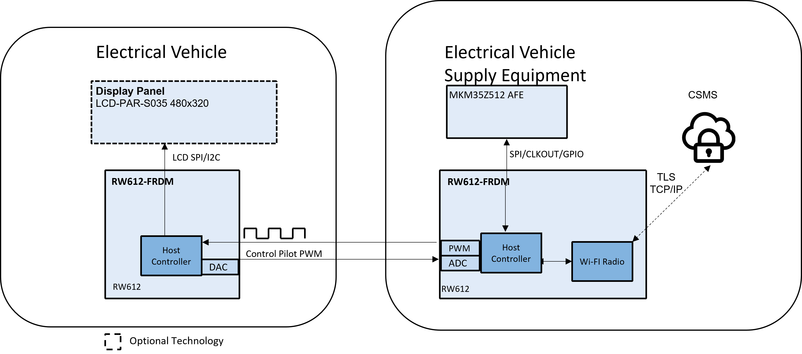
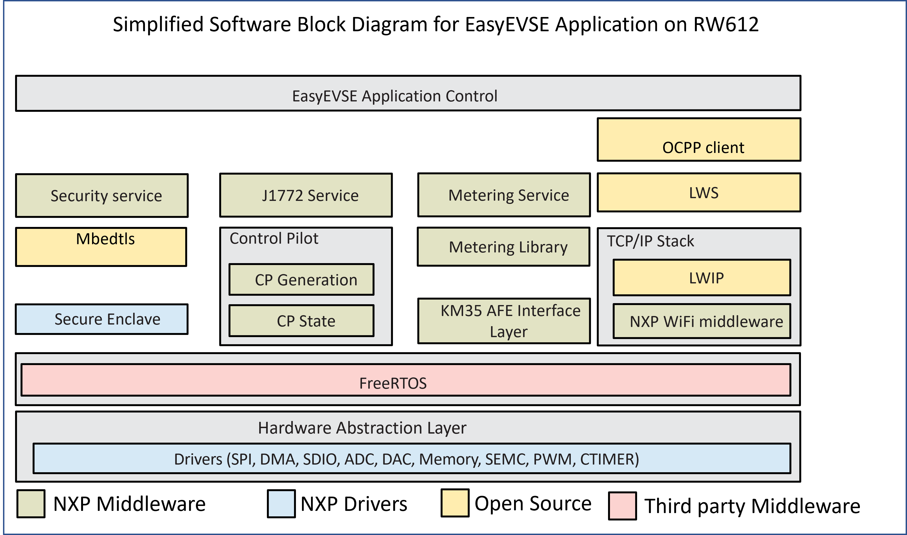
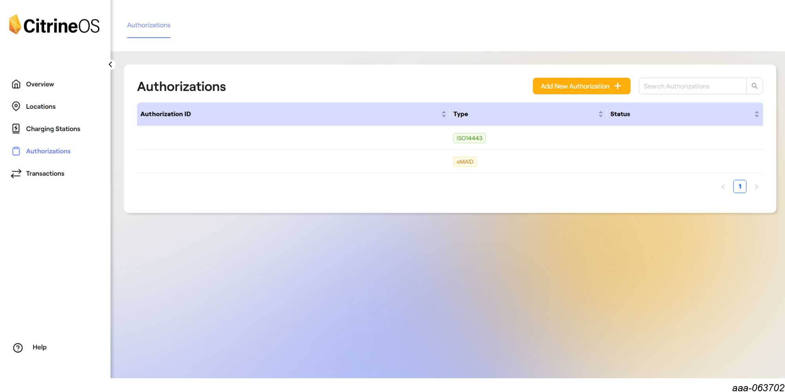
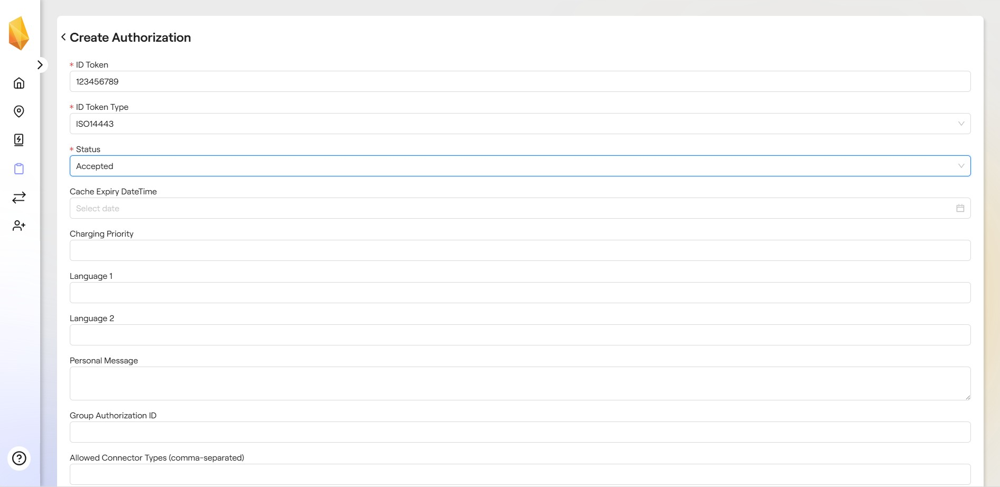
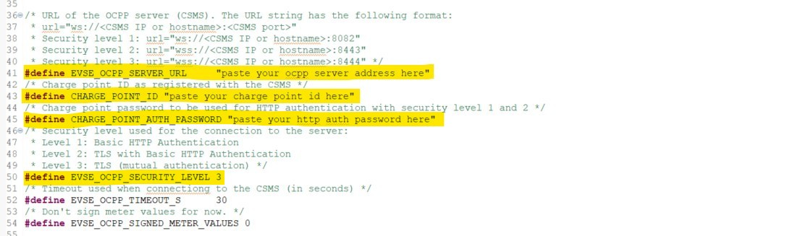
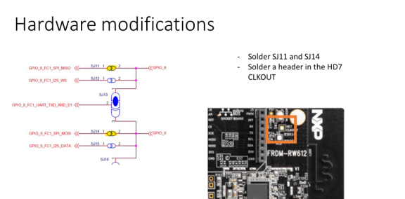

# NXP Application Code Hub

## RW612 EVSE with J1772, Metrology and OCPP

This Proof of Concept (PoC) is part of NXP’s EVSE offering and showcases a fully simulated charging station that integrates Metrology, J1772 control, and CSMS communication over OCPP. In addition to the EVSE code, the project offers a simulated RW612 EV binary.

The RW612 EasyEVSE setup demonstrates an electric vehicle supply equipment (EVSE) implementation capable of running multiple functional domains in parallel:

- J1772 charging protocol handling
- Real‑time 3‑phase metrology computation
- OCPP communication over Wi‑Fi (Security Profiles 1–3)
- Interoperability with CitrineOS as the CSMS backend
- Metrology 

### SAE J1772 Standard

+ SAE J1772 is the North American standard for EV conductive charging, defining
the connector, signal logic, and communication protocol between Electric
Vehicle Supply Equipment (EVSE) and Electric Vehicles (EV).
+ Signal Logic States:
    + +12 V (no load): EVSE ready, no EV connected
    + +9 V (resistor load): EV connected
    + +6 V (diode load): EV ready for charging
    + 0 V: Charging error or fault
    + –12 V: EVSE not available

#### J1772 State details

|Nr.| State |Prompt |Remarks|
|:-----------|:--------------|:-------------------|:-------------------------------------|
|1|STATE_A|Standby|EV not connected; EVSE idle and waiting|
|2|STATE_A2|Standby, PWM ON|EVSE is signaling via PWM but EV not connected|
|3|STATE_B|Vehicle detected|EV connected but not ready to charge|
|4|STATE_B2|Vehicle detected|EV connected and PWM active; ready for handshake|
|5|STATE_C|Vehicle Ready (no charging)|EV is ready for charge|
|6|STATE_C2|Vehicle Ready (charging)|EV is actively charging; current is flowing|
|7|STATE_D|Ventilation (no charging)| EV requires ventilation before charging. Ventilation in EV charging refers to a safety condition where the electric vehicle requires external air circulation during charging to prevent buildup of hazardous gases.|
|8|STATE_D2|Ventilation (charging)|Charging with ventilation requirement met|
|9|STATE_E|No power|EVSE not supplying power; fault or disabled|
|10|STATE_F|Error|Fault detected; EVSE or EV error condition|

### Metrology Information
The EVSE uses the KM35 as an external AFE to provide raw metrology data, which is processed on the RW612. 
The metrology subsystem delivers a comprehensive set of electrical measurements. These include billable energy values as well as instantaneous electrical parameters, such as:

- Energy consumption (active energy, per-phase)
- Instantaneous voltage
- Instantaneous current
- Instantaneous power (real power, per-phase)

These measurements can be used for billing, diagnostics, and real‑time monitoring, and are transmitted to the CSMS via OCPP.

### OCPP CSMS 2.0.1
+ Authorization
+ Remote control Start/Stop charging
+ Transaction lo​gging and reporting
+ Real‑time charging session management

  
  
Figure 1: System Overview

### KM35 Role 
+  Analog Front End (AFE): Measures Voltage samples U1, U2, U3, I1, I2, I3
+  SPI Frame Packaging: Transmits Raw ADC or RMS data
+  Track sample timing and buffer alignment
+  Data Ready Signal: Notify RW612 that new data is available

⚠️**Warning:** The data provided by the KM35 are simulated data. Don't connect KM35 directly to the grid.

### EV Role
+ EV sends different voltage levels and bases on that voltage EVSE detects the states
+ EV handles states transition by modifying the output value of a DAC
+ Based on state EVSE generates PWM signal and sends to EV

⚠️**Warning:** The communication between the EV and EVSE is simulated. The CP values are not +12V, +9V, +6V, 0V, and –12V as per SAE J1772 standard, but rather simulated voltage levels to demonstrate the state transitions. To use the real 12V use the [EVSE-SIG-BRD ](https://www.nxp.com/design/design-center/development-boards-and-designs/EVSE-SIG-BRD) or EVSE-EMETER

#### Boards: TWR-KM35Z75M, FRDM-RW612
#### Categories: Industrial, Networking, Cloud Connected Devices, HMI, RTOS, Power Conversion
#### Peripherals: DAC, ADC, PWM, SPI, Wi-Fi, TIMER
#### Toolchains: MCUXpresso IDE, VS Code

## Table of Contents
1. [Software](#step1)
2. [Hardware](#step2)
3. [Setup](#step3)
4. [Results](#step4)
5. [Limitation](#step5) 
6. [Release Notes](#step6)
7. [Related Platforms](#step7)

## 1. Software
* [MCUXpresso IDE V25.6 or later](https://www.nxp.com/design/design-center/software/development-software/mcuxpresso-software-and-tools-/mcuxpresso-integrated-development-environment-ide:MCUXpresso-IDE) or VS Code with MCUXpresso extension

  
  
Figure 2: RW61X EVSE DEMO

## 2. Hardware
- 2x RW612 boards [FRDM-RW612](https://www.nxp.com/design/design-center/development-boards-and-designs/FRDM-RW612)
- 1x KM35 metrology AFE board [TWR-KM35Z75M](https://www.nxp.com/design/design-center/development-boards-and-designs/TWR-KM35Z75M)

## 3. Setup

### 3.1 Step 0: Prerequisites
#### Setup CitrineOS OCPP server (CSMS)

EasyEVSE is a development platform that enables you to develop and run a simulated electric vehicle charging station managed by an open source Charging Station Management System (CSMS), CitrineOS. To set up your CitrineOS CSMS, follow the instructions in the *Charging Station Management System (CSMS) Installation and Configuration User Guide* (document [UG10362](https://www.nxp.com/doc/UG10362)).

##### CitrineOS Web UI

To open the CitrineOS Web UI, follow the steps below:
1. In your browser, go to http://\<machine-ip\>:3000, where machine-ip is the IP address of the machine that hosts CitrineOS core.
1. Use administrator credentials to log in.

##### Charge point registration

Before exchanging information with CitrineOS, the charging station must be registered with the CSMS. Follow the instructions in the *Charging Station Management System (CSMS) Installation and Configuration User Guide* (document [UG10362](https://www.nxp.com/doc/UG10362)) to register the EasyEVSE to the CitrineOS instance. 

When authenticating with the CSMS, the EasyEVSE application uses one of the following security profiles, depending on the settings in EVSE_ConnectivityConfig.h:
1. **Security Profile 1**: HTTP Basic Authentication with password
2. **Security Profile 2**: HTTP Basic Authentication with password and TLS 1.2 (server authentication only)
3. **Security Profile 3**: TLS 1.2 with mutual authentication (client and server certificates)

By default, the EasyEVSE application uses security level 3 leveraging TLS with mutual authentication.

When registering your charging station, choose a unique name to identify your charging station (e.g. “cp001”). Remember this registration ID as it is needed by the EasyEVSE application when connecting to the CitrineOS. An HTTP authentication password is also required for security profiles 1 and 2. By default, the registering script uses the password "DEADBEEFDEADBEEF" when adding a charging station to CitrineOS.

After completing the registration process, open your CitrineOS interface, go to the “Charging Stations” window and you should see your charging station with the corresponding ID and the “Offline” status. Click on your specific charging station and go to "Add Connector". Use 'ConnectorID' = 1 and 'ConnectorIDType' = 1, when prompted (the EasyEVSE application is configured to run as EVSE: 1, connector: 1).

##### Manage authorization list

To add your authorization tokens in the authorization list, follow the steps below:
1. In your CitrineOS interface, in the left panel, go to the “Authorizations” window.
2. Click the “Add New Authorization” button.

3. In the “Authorization Id Token” field, add your authorization token Id. In the “IdToken Type” dropdown list, select your token type. The three authorization types available with the EasyEVSE application (full enablement version) are described below:
- If you want to register an NFC card, select ‘ISO14443’ as the token type and your card’s UID in the “Authorization Id Token” field.

**Note**: You can get the card UID from the EasyEVSE logs (search for 'Card UID' after tapping the card), the EasyEVSE GUI or by using an NFC reader application.

   - If you want to register a contract certificate for Plug and Charge, select ‘eMAID’ as the token type and add your eMAID value in the “Authorization Id Token” field.

**Note**: You can get the eMAID from the EasyEVSE logs (search for 'emaid value') or extract the CN field from the certificate using a crypto tool/library. The eMAID value is different for `ISO15118-2` and `ISO15118-20`.

   - If you want to register a local token, select ‘Local’ as the token type and add the string “AUTH_FROM_CLI” in the “Authorization Id Token” field. In the EasyEVSE application, you can do local authorizations using the ‘auth true’ command in the cli.

### 3.2 Step 1: Software setup

Clone the [APP-CODE-HUB/dm-ocpp-evse-rw612](https://github.com/nxp-appcodehub/dm-ocpp-evse-rw612) repository.

#### Import the project in MCUXpresso IDE or VS Code

To import the project in MCUXpresso IDE:
1. Proceed to import the project from filesystem
2. Choose the previously cloned archive
3. Go to project selection
4. MCUXpresso IDE or VS Code will automatically detect 2 projects:
* OCPP project with the OCPP stack implementation for the EVSE application.
* EasyEVSE project with Debug build configuration.

#### Configure the EasyEVSE application to connect to your CSMS

In the EasyEVSE application code, to set up your connection to CitrineOS CSMS, go to the /source/config/EVSE_ConnectivityConfig.h file and:

1. Set the EVSE_OCPP_SERVER_URL macro to the URL of the CitrineOS instance that you are using.The URL string has the following format: url="ws://<CSMS IP or hostname>:\<CSMS port\>":
 * Security level 1: url="ws://\<CSMS IP or hostname\>:8082"
 * Security level 2: url="wss://\<CSMS IP or hostname\>:8443"
 * Security level 3: url="wss://\<CSMS IP or hostname\>:8444"
2. Set the CHARGE_POINT_ID macro to the ID of the charge point as registered in CitrineOS (e.g. "cp001").
3. Set the CHARGE_POINT_AUTH_PASSWORD macro to the HTPP authentication password as registered in CitrineOS (e.g. "DEADBEEFDEADBEEF"). For security profile 3, this password is not needed.
4. Set the EVSE_OCPP_SECURITY_LEVEL macro to the security level you are using to connect to the CitrineOS CSMS.
5. Set the WIFI_SSID and WIFI_PASS mac macros to your Wi-Fi network credentials.
6. Build the project and flash it to the EVSE RW612 device.
7. Flash the EV RW612 device using the binary from /RW612 EVSE/rw612_ev.axf

#### 3.2.1 KM35 Set-up

For information on KM35 metrology build, please refer to the [dm-nxp-km-metrology](https://github.com/nxp-appcodehub/dm-nxp-km-metrology) repository. The EVSE-SIG-BRD2X is replaced with the RW612 board.

### 3.3 Step 2: HW setup
In order to have the setup running, you need to modify the RW612 hardware.

#### 3.3.1 RW612 EVSE - TWR-KM35

#### 3.3.2 RW612 EVSE - RW EV

## 4. Results
On both EV and EVSE devices, open a serial terminal (e.g., PuTTY) set with 115200 baud rate to view the application logs. The EasyEVSE application will start the OCPP communication with CitrineOS and you should see the charging station coming online in the CitrineOS interface.

## 5. Limitation
Limitations with the current implementation:

In case of a disconnect from the CSMS, the EVSE will try to reconnect for approximately 15 minutes. After that time, you will need to reset the board to reconnect.
The remote start and stop functionalities have not been validated with CitrineOS CSMS.

#### Project Metadata

<!----- Boards ----->

<!----- Categories ----->

<!----- Peripherals ----->

<!----- Toolchains ----->

Questions regarding the content/correctness of this example can be entered as Issues within this GitHub repository.

>**Warning**: For more general technical questions regarding NXP Microcontrollers and the difference in expected functionality, enter your questions on the [NXP Community Forum](https://community.nxp.com/)

## 6. Release Notes
| Version | Description / Update                           | Date                        |
|:-------:|------------------------------------------------|----------------------------:|
| 1.0     | Initial release on Application Code Hub        | March 25th 2026 |

## 7. Related Platforms
- [**KM35**](https://github.com/nxp-appcodehub/dm-nxp-km-metrology) 
- [**EasyEVSE RT106X**](https://github.com/nxp-appcodehub/rd-nxp-easyevse-imxrt106x)
- [**EVSE-RW612-MATTER**](https://github.com/nxp-appcodehub/dm-matter-evse-demo-on-frdm-rw612/)
- [**EVSE-SIG-BRD2X**](https://github.com/nxp-appcodehub/dm-lpc5536-evse-sigbrd)
- [**SIGBRD-HPGP**](https://github.com/nxp-appcodehub/dm-evse-sigbrd-hpgp/)
- [**SIGBRD-EMETER**](https://github.com/nxp-appcodehub/rd-evse-emeter/)